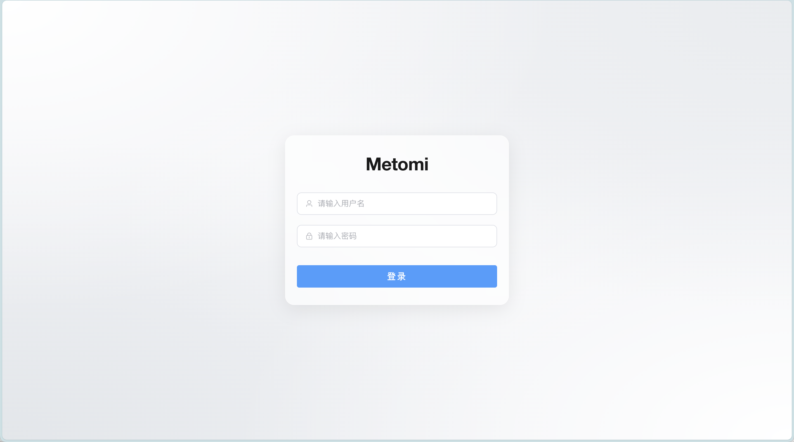
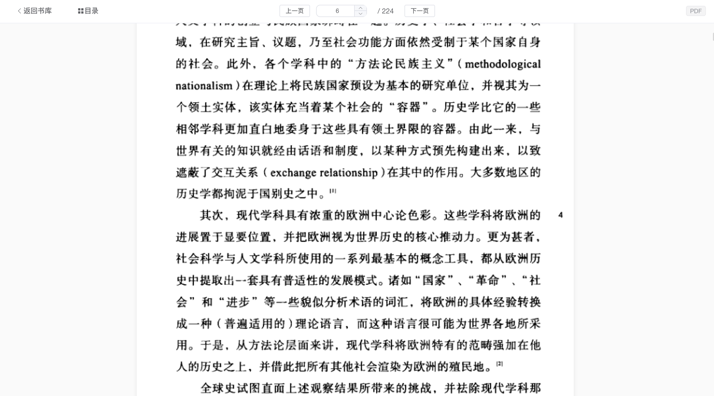

<div align="center">
  <h1>📚 Metomi</h1>
  <p>一个现代化、轻量级的个人电子书管理与在线阅读系统 (A Modern & Lightweight Self-hosted E-book Manager)</p>
  <p>
    <a href="./README.md">English</a> | <b>中文</b>
  </p>
</div>

## ✨ 特性

- **🖥 现代化的界面**：基于 Vue 3 + Composition API，提供流畅的 SPA 体验和精美的 UI 设计，完美适配桌面端和移动端。
- **📖 沉浸式在线阅读**：内置强大的 Web 阅读器，支持无缝直接打开并阅读 **PDF** 和 **EPUB** 格式，无需下载即可享受阅读。
- **⚡️ 极速后端**：基于 Python FastAPI 构建，采用全异步架构，响应迅速。
- **🕷 智能元数据抓取**：自动从外部数据源（如豆瓣）抓取图书标题、作者、出版社、简介及高清封面。
- **💾 原生下载流处理**：支持浏览器原生下载进度条展示，通过服务端直通流处理大文件，拒绝内存溢出。
- **🔒 安全与健壮**：防御路径穿越 (Path Traversal)、SSRF 等极客部署下的常见安全风险，保障个人服务的数据安全。
- **🚀 零配置启动**：后端自动初始化 SQLite 数据库和系统必要结构，开箱即用。

---

## 📸 界面预览

### 登录页


### 书库概览


### 在线阅读器


---

## 🛠 技术栈

### 前端
- **核心框架**: Vue 3 (Composition API)
- **路由管理**: Vue Router
- **数据交互**: Axios
- **阅读器核心**: PDF.js, Epub.js
- **构建工具**: Vite

### 后端
- **核心框架**: FastAPI (Python)
- **数据库与ORM**: SQLite, SQLAlchemy
- **数据库迁移**: Alembic
- **数据校验**: Pydantic
- **安全机制**: JWT 身份验证, bcrypt 密码哈希

---

## 🚀 部署引导

### 选项 1: Docker 部署 (推荐) 🐳

你可以使用 Docker 快速部署 Metomi。项目根目录提供了 `docker-compose.yml`，它将构建一个包含前后端的统一单端口镜像。

1. **下载配置文件**
   ```bash
   mkdir metomi && cd metomi
   wget https://raw.githubusercontent.com/SiwayLab/metomi/refs/heads/main/docker-compose.yml
   ```
2. 启动服务：
   ```bash
   docker-compose up -d
   ```
3. 访问系统：
   打开浏览器并访问 `http://localhost:8000`。

### 选项 2: 本地开发环境手动启动 💻

确保你安装了 Python 3.9+ 和 Node.js 16+。

#### 后端启动：
```bash
cd backend
python -m venv .venv
source .venv/bin/activate  # Windows 下请使用 .venv\Scripts\activate
pip install -r requirements.txt
uvicorn app.main:app --host 0.0.0.0 --port 8000 --reload
```

#### 前端启动：
```bash
cd frontend
npm install
npm run dev
```

---

## 🤝 贡献与开源

欢迎提交 Issue 或 Pull Request！这本来是一个个人的自用项目，但我们相信开源能让它变得更好。
如果你觉得这个项目对你有帮助，请在右上角给个 ⭐️ Star！

## 📄 许可证

本项目采用 MIT License 开源许可。
